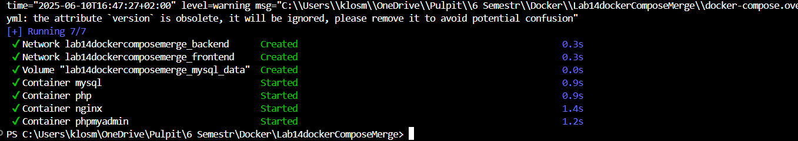
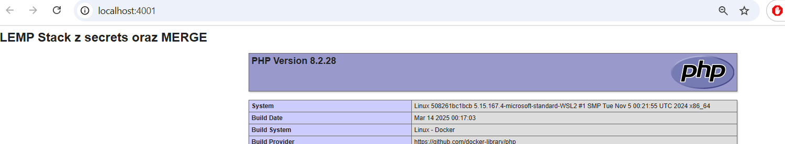
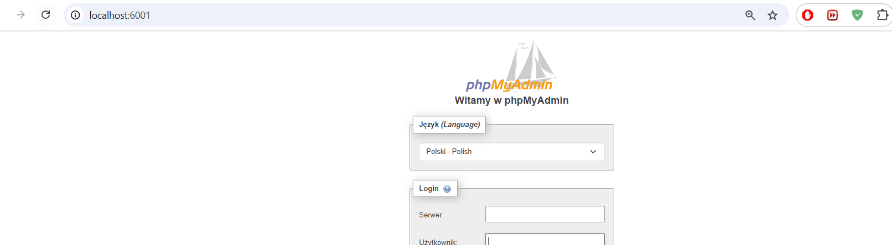

# Labolatrium 14
Stworzenie merge dla dockercompose z lab 13

### Polecenie 1
uruchomienie plików compose:
docker compose -f docker-compose.base.yml -f docker-compose.override.yml up -d
Sprawdzenie statusu kontenerów -> docker compose ps 

### Polecenie 2
Sprawdzenie konfiguracji:
docker compose -f docker-compose.base.yml -f docker-compose.override.yml config

### Polecenie 3
Sprawdzenie sekretów:
docker exec mysql ls -la /run/secrets/

### Polecenie 4
Sprawdzenie działania stron:

### Polecenie 5
Zatrzymanie lempa :
docker compose down 